# Click'n Borrow API

Click'n Borrow is a web implementation of a reservation system in a library. It allows users to browse available books, reserve them, and see their own reservations and its current status. User can also add books to the bookmarks list. Administrators can add new books to the database and manage reservations.

The new version of project uses Laravel for backend API and Vue.js for frontend. We've chosen Laravel because it is a powerful and flexible PHP framework that provides a wide range of features for building web applications. Additionally, unique features such as Eloquent ORM, middleware, and routing make it easy to build RESTful APIs. Vue.js is a popular JavaScript framework that allows developers to build interactive and dynamic user interfaces. It is lightweight, fast, and easy to integrate with other libraries and projects. Together, Laravel and Vue.js provide a powerful and efficient solution for building modern web applications.


# Table of Contents

1. [Features](#features)
2. [Technology Stack](#technology-stack)
3. [Database Design and Structure](#database-design-and-structure)
4. [Installation](#installation)
5. [API Endpoints Overview](#api-endpoints-overview)
6. [Screens](#screens)
7. [License](#license)


## Features

- **User Authentication:**
    - Users can create accounts, log in, and log out.
    - Passwords are hashed and securely stored in the database.

- **Book Browsing:**
    - Users can browse available books and see detailed information about each book.
    - Books can be searched by category, author, and title.

- **Book Reservation:**
    - Users can reserve books and see their current reservation status.
    - Administrators can manage reservations and change their status.

- **Bookmarks:**
    - Users can add books to the bookmarks list.
    - Users can see their bookmarks list.

- **Admin Panel:**
    - Administrators can add new books to the database.
    - Administrators can manage reservations and change their status.

- **Responsive Design:**
    - The application is fully responsive and works on all devices, including desktops, tablets, and mobile phones.

- **Data Validation:**
    - Input data is validated on the client and server sides to ensure data integrity and security.


## Technology Stack

The project is built using the following technologies:
### Backend:
 - **Framework**: Laravel 11
 - **Authentication**: Laravel Sanctum
 - **Queue**: Redis
 - **Database**: PostgreSQL

### Frontend:
 - **Framework**: Vue.js 3
 - **Routing**: Vue Router
 - **HTTP Client**: Axios

### Infrastructure
 - **Docker**
 - **Docker Compose**

## Database Design and Structure

The project includes a comprehensive design and structure for the database, ensuring efficient data storage and retrieval. Here are the key components:

1. **Entity-Relationship Diagram (ERD):**
   - 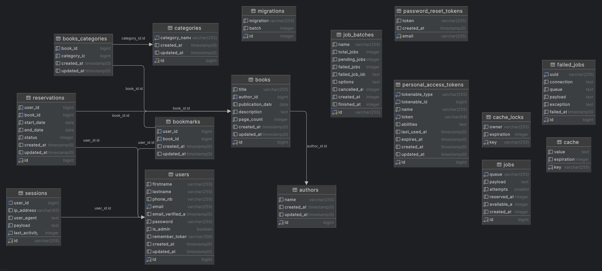

2. **Database migrations:**
    - The project includes database migrations that define the structure of the database tables and relationships.
    - Migrations can be run using the `sail artisan migrate` command.

## Installation

1. ** Clone the repository:**
   ```bash
   git clone https://github.com/Dibisek/clicknborrow-api
   ```

2. **Navigate to the project directory:**
   ```bash
    cd clicknborrow-api
   ```

3. **Copy the .env.example file to .env:**
   ```bash
   cp .env.example .env
   ```

4. **Run the following command to start the Docker containers:**
   ```bash
   ./vendor/bin/sail up -d
    ```

5. **Migrate the database and seed it with sample data:**
   ```bash
   ./vendor/bin/sail artisan migrate --seed
   ```

6. **Go to frontend directory:**
   ```bash
   cd ../frontend
   ```

7. **Install the dependencies:**
   ```bash
    npm install
    ```

8. **Start the development server:**
   ```bash
    npm run dev
    ```

<br>

> The frontend is now running on http://localhost:5174 <br>
> The backend is now running on http://localhost <br>
> To access the API, go to http://localhost/api/v1/

## API Endpoints Overview
### Authentication
 - **POST** `/api/v1/login`: Log in to get an API token
 - **POST** `/api/v1/register`: Register a new user
 - **POST** `/api/v1/logout`: Log out and invalidate the API token

### Books
 - **GET** `/api/v1/books`: Get all books
 - **GET** `/api/v1/books/{id}`: Get a specific book
 - **POST** `/api/v1/books`: Add a new book
 - **PUT** `/api/v1/books/{id}`: Update a book
 - **PATCH** `/api/v1/books/{id}`: Partially update a book
 - **DELETE** `/api/v1/books/{id}`: Delete a book

### Reservations
 - **GET** `/api/v1/reservations`: Get all reservations
 - **GET** `/api/v1/reservations/{id}`: Get a specific reservation
 - **POST** `/api/v1/reservations`: Add a new reservation
 - **PUT** `/api/v1/reservations/{id}`: Update a reservation
 - **PATCH** `/api/v1/reservations/{id}`: Partially update a reservation
 - **DELETE** `/api/v1/reservations/{id}`: Delete a reservation

### Categories
 - **GET** `/api/v1/categories`: Get all categories
 - **GET** `/api/v1/categories/{id}`: Get a specific category

<br>

### You can also filter the API results for example:
`http://localhost/api/v1/books?title[like]=%et%` - will return all books with title containing 'et'
`http://localhost/api/v1/books/2?includeReservations=true` - will return book with id 2 and all its reservations

<br>

>Filter parameters and available operators are available in `/backend/app/Filters/V1` directory

## Screens

#### Login
| Desktop       | Mobile     |
|:-------------:|:------------:|
|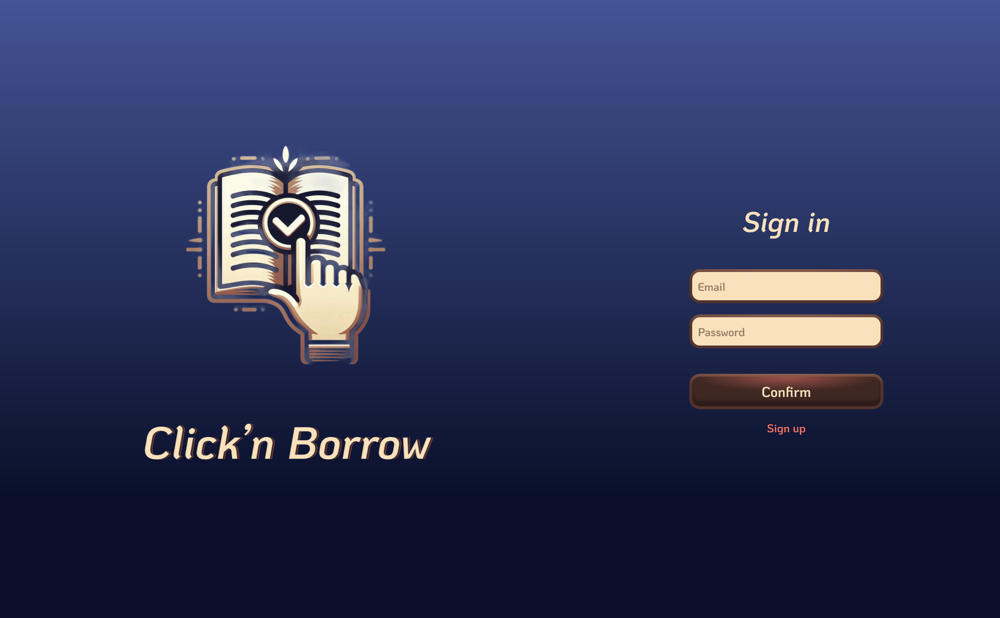 | 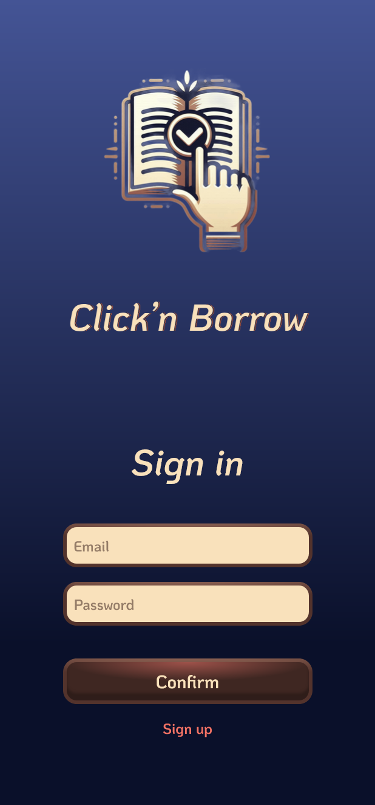

#### Main
| Desktop       | Mobile     |
|:-------------:|:------------:|
|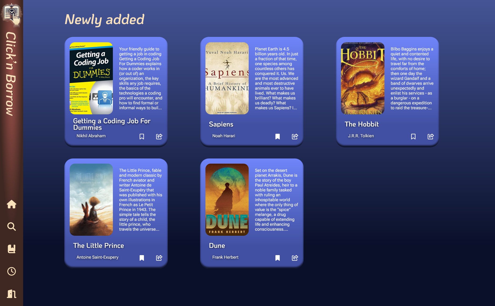 | 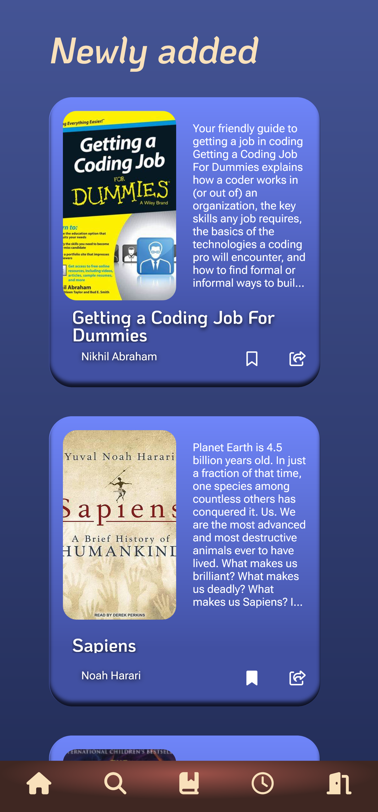

#### Search
| Desktop       | Mobile     |
|:-------------:|:------------:|
|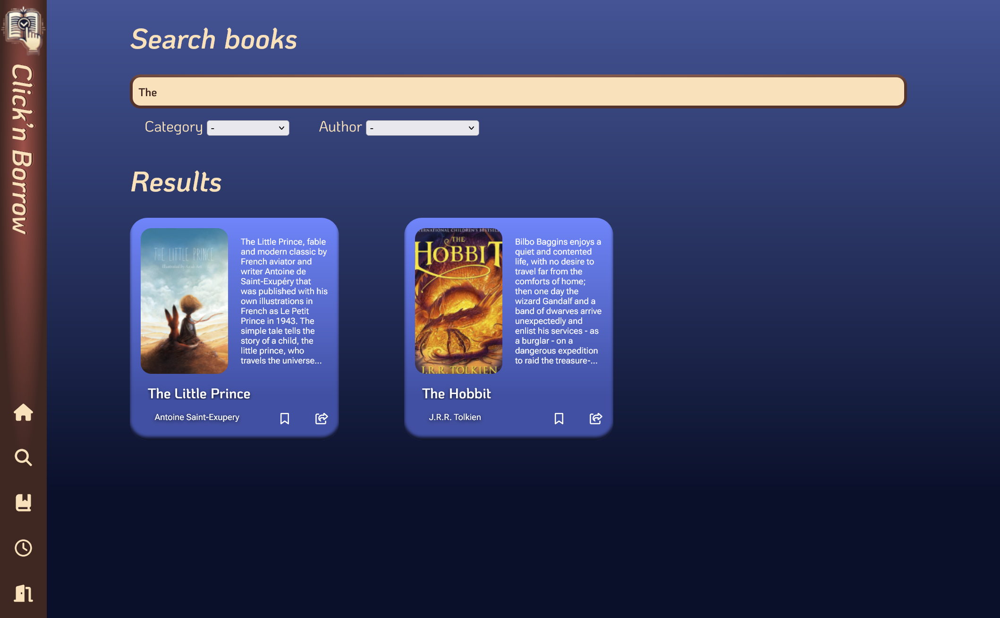 | 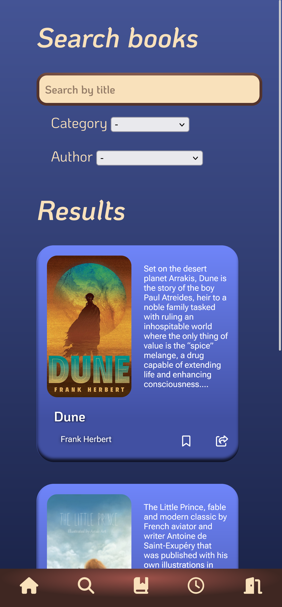


#### Reservation History
| Desktop       | Mobile     |
|:-------------:|:------------:|
| | 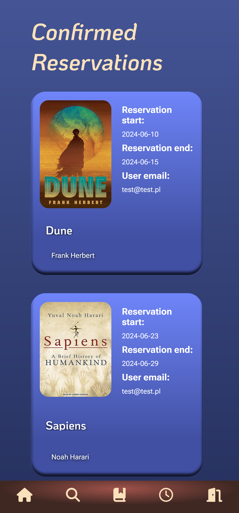

#### Add Book
| Desktop       | Mobile     |
|:-------------:|:------------:|
|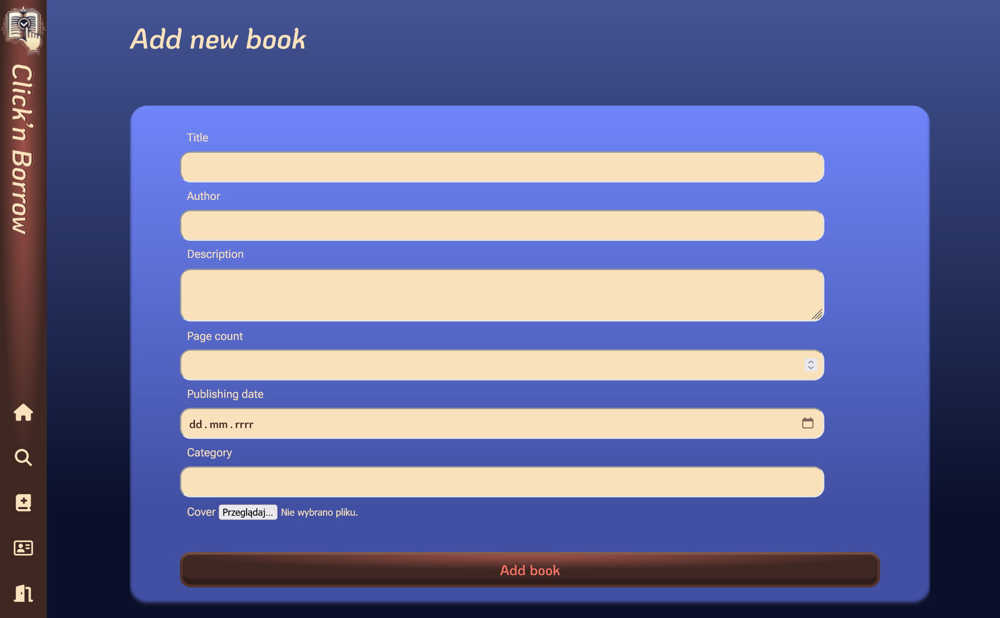 | 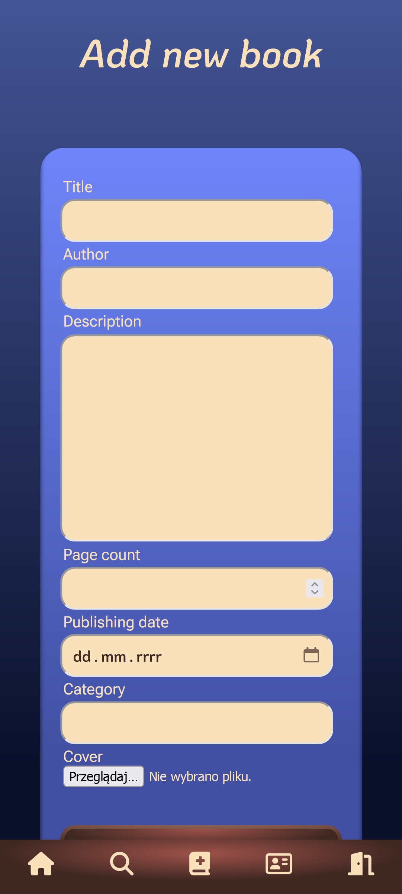

### Bookmarks
| Desktop       | Mobile     |
|:-------------:|:------------:|
|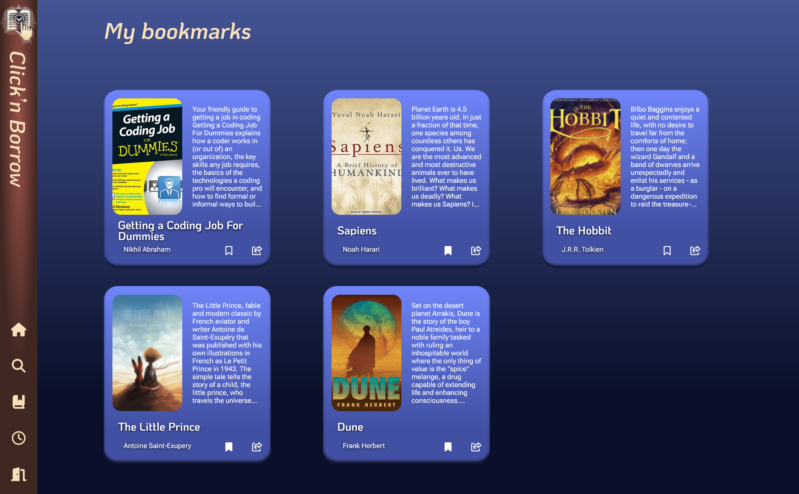 | 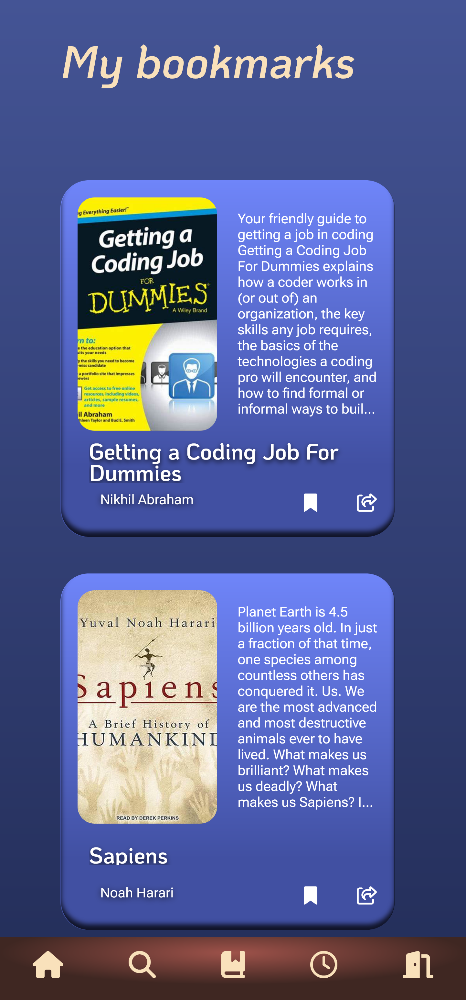

## License

This project is licensed under the MIT License


